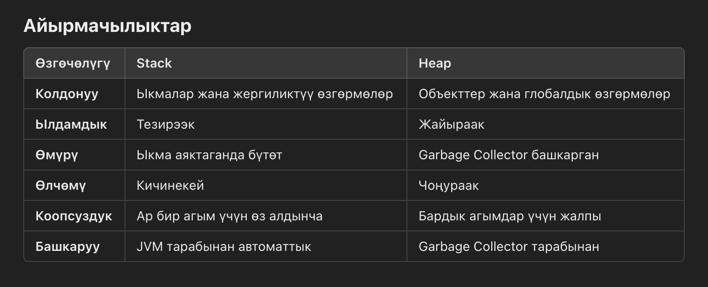

                        Task: Simple Note
Жөнөкөй эскертмелерди (заметки) жазуу колдонмосун түзүңүз, ал колдонуучуга төмөнкү иштерди аткарууга мүмкүндүк берет:
Жаңы эскертме жазып, аны файлга сактоо.
Файлдан бардык сакталган эскертмелерди окуу.
Бардык эскертмелерди өчүрүү.
Талаптар:
Эскертмелерди файлга сактоо үчүн FileWriter колдонуу, файлдын аты notes.txt болушу керек.
Бардык эскертмелерди файлдан окуу жана көрсөтүү үчүн FileReader колдонуу.
Колдонуучуга файлдын мазмунун тазалоо менен бардык эскертмелерди өчүрүү мүмкүнчүлүгүн берүү.
Ишке ашыруу кадамдары:
Колдонуучу интерфейси (консоль аркылуу):

Төмөнкү варианттары бар менюну көрсөтүү:
Жаңы эскертме кошуу.
Бардык эскертмелерди көрүү.
Бардык эскертмелерди өчүрүү.
Чыгуу.
Функционалдык талаптар:
Эскертме кошуу: Колдонуучудан эскертмени жазып, аны notes.txt файлына кошууну сураныз. Ар бир эскертме жаңы сапта сакталат.
Бардык эскертмелерди көрүү: notes.txt файлынын мазмунун окуп, бардык эскертмелерди көрсөтүңүз.
Бардык эскертмелерди өчүрүү: Файлды тазалаңыз.
Чыгуу: Колдонмону жабыңыз.

                               Heap жана Stack Java тилинде
Java жана башка көптөгөн программалоо тилдеринде heap (куча) жана stack (стек) —   
бул программаны аткаруу учурунда ар кандай максаттарда колдонулган эки эс тутум аймагы. 
Алардын ролдорун жана өзгөчөлүктөрүн түшүнүү эс тутумду башкарууга жана натыйжалуу программаларды жазууга жардам берет.

1. Stack (Стек)
   Аныктама: Эс тутум аймагы, ал ыкмаларды чакырууну, жергиликтүү өзгөрмөлөрдү жана аткаруу агымын башкаруу үчүн колдонулат.

Негизги өзгөчөлүктөрү:
Структурасы: LIFO (акыркы кирди, биринчи чыкты) принцибин карманат.
Өлчөмү: Көбүнчө кичинекей жана heap'ка салыштырмалуу чектелген.
Өмүрү: Стектеги маалыматтар ыкманын аткарылышына байланган жана ыкма аяктагандан кийин автоматтык түрдө жок кылынат.
Коопсуздук: Ар бир агымдын өз стеги бар, бул аны коопсуз кылат.
Ылдамдыгы: Стекке кирүү тезирээк, анткени ал туруктуу эс тутум процесстерин колдонот.
Стекке эмне сакталат:

Ыкма чакыруулары.
Жергиликтүү өзгөрмөлөр (примитивдер жана heap'теги объекттердин шилтемелери).
Ыкманын параметрлери.
Мисал:
java
Копировать код
public class StackExample {
public static void main(String[] args) {
int x = 10; // Стекте сакталат
methodA();
}

    static void methodA() {
        int y = 20; // Стекте сакталат
        methodB();
    }

    static void methodB() {
        int z = 30; // Стекте сакталат
    }
}
Ар бир ыкманы чакыруу жаңы "рамканы" (stack frame) жаратат.
x, y, жана z ыкма аяктагандан кийин жок кылынат.
2. Heap (Куча)
   Аныктама: Эс тутум аймагы, ал объекттерди жана класс деңгээлиндеги өзгөрмөлөрдү сактоо үчүн колдонулат.

Негизги өзгөчөлүктөрү:

Структурасы: Азыркыга салыштырмалуу тартипсиз.
Өлчөмү: Чоңураак жана динамикалуу өзгөрө алат.
Өмүрү: Heap'теги объекттерге шилтеме жок болсо, алар Garbage Collector тарабынан тазаланат.
Коопсуздук: Бардык агымдарга жалпы, демек синхрондоштуруу керек.
Ылдамдыгы: Стекке караганда жайыраак.
Heap'ке эмне сакталат:

Бардык new аркылуу түзүлгөн объекттер.
Класс деңгээлиндеги өзгөрмөлөр.
Объекттин экземпляр өзгөрмөлөрү.
Мисал:
java
Копировать код
public class HeapExample {
int instanceVariable; // Heap'те сакталат

    public HeapExample(int value) {
        this.instanceVariable = value;
    }

    public static void main(String[] args) {
        HeapExample obj1 = new HeapExample(10); // Heap'те объект, стекте шилтеме
        HeapExample obj2 = new HeapExample(20); // Дагы бир объект heap'те
    }
}

